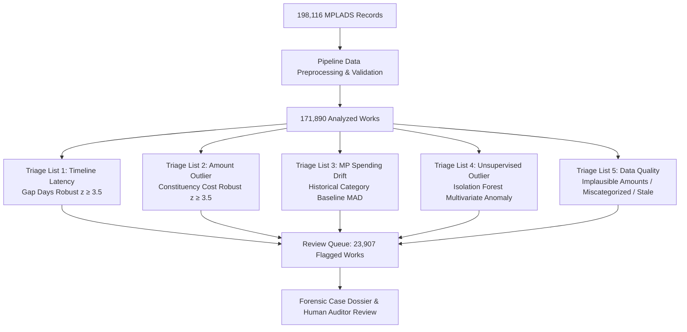

> Dashboard integrity cleanup: see [source definitions, regenerated counts and limitations](docs/dashboard-integrity.md). The snapshot has 23,329 rule-only flags and 23,907 flags including Isolation Forest; DQ is separate.

# NIDHI TRACE — MPLAD-INSIGHT

<div align="center">

**National Intelligence for Developmental Harnessing & Irregularity Tracking**  
*Algorithmic Audit & Multi-Signal Triage Platform for Member of Parliament Local Area Development Scheme (MPLADS)*

[](https://fastapi.tiangolo.com)
[](https://python.org)
[](https://scikit-learn.org)
[](https://tailwindcss.com)
[](https://nidhi-trace.vercel.app/)
[](https://nidhitrace-api.onrender.com)

</div>

<div align="center">

### 🌐 Live Platform: [https://nidhi-trace.vercel.app/](https://nidhi-trace.vercel.app/)

</div>

---

## 📌 Executive Summary & Purpose

The **Member of Parliament Local Area Development Scheme (MPLADS)** entitles each Member of Parliament (MP) to recommend development works up to **₹5 Crore per annum** for community asset creation across India. With hundreds of thousands of sanctioned projects spanning 785 district authorities, statutory audit bodies (MoSPI, CAG, State Finance Departments) face acute challenges:

1. **Information Asymmetry & Scale**: Auditing >190,000 project dockets manually is administratively unfeasible.
2. **Timeline Stagnation**: Administrative delays from MP recommendation to formal district sanction frequently stretch into years without detection.
3. **Econometric Variance**: Wide cost discrepancies across implementing agencies and districts often mask inflated contractor estimates or split-tenders.
4. **Pitfalls of "Blended Severity Scoring"**: Generic single-score heuristics (e.g. weighted arbitrary scores from 0-100) fail in practice—weighting attempts inevitably suppress subtle delays or over-amplify benign high-value infrastructure.

**NIDHI TRACE** solves this by establishing a **statistically validated, multi-signal audit pipeline**. Instead of opaque blended scores, the platform segments the review workload into **five independent, non-interfering triage lists** grounded in robust statistical methods ($\text{Robust } z \ge 3.5$), empowering vigilance officers and financial auditors to prioritize manual scrutiny with total transparency.

---

## 📊 Core Platform Figures (Validated Dataset Seed)

The system operates over a consolidated, empirical seed of MPLADS works derived from official administrative filings:

| Dimension | Metric / Figure | Context & Notes |
|---|---|---|
| **Total Registered Works** | **198,116** | Consolidated administrative records across 785 district nodes |
| **Analyzed Works** | **171,890** (86.8%) | Records processed through multi-signal econometric pipeline |
| **Review Queue (Flagged)** | **23,907** (13.9%) | Works triggering at least one independent statistical triage list |
| **Critical / High Severity Outliers** | **1,137** (4.9% of flagged) | Breaching robust statistical bounds ($\text{Robust } z \ge 3.5$) |
| **Total Analyzed Corpus** | **₹8,501.1 Cr** | Cumulative value of analyzed infrastructure allocations |
| **Flagged Review Exposure** | **₹1,769.8 Cr** (20.8%) | Total rupee value associated with flagged works |
| **High-Severity Exposure** | **₹262.3 Cr** | Capital allocated to severe cost/timeline outliers |
| **Data Quality Exposure** | **₹494.2 Cr** | Capital tied to reporting errors, stale records, or misclassifications |

---

## 🔬 Audit Methodology: Five Independent Triage Lists

Rather than a single synthetic score, NIDHI TRACE applies **five decoupled statistical and algorithmic triage lists**:



### 1. Recommendation-to-Sanction Latency (`flag_delay`)
- **Metric**: Elapsed calendar days (`gap_days`) between MP recommendation and district administrative sanction.
- **Formulation**:
  $$\text{Robust } z = \frac{\text{Delay} - \text{Median}(\text{district})}{\text{MAD}(\text{district}) \times 1.4826}$$
- **Threshold**: Triggered when $\text{Robust } z \ge 3.5$ or `gap_days` > 180 days relative to median district processing latency.

### 2. Sanction Amount Outlier (`flag_amount`)
- **Metric**: Sanctioned allocation amount evaluated against category distribution within the specific constituency and state.
- **Formulation**: Robust $z$-score based on median and median absolute deviation (MAD) within `(constituency, work_category)` cohorts.
- **Threshold**: Triggered when $\text{Robust } z \ge 3.5$, flagging unusually expensive projects relative to peer works in the same category.

### 3. MP Spending Pattern Drift (`flag_mp_drift`)
- **Metric**: Evaluates whether an MP is channeling funds into a specific work category at rates that diverge drastically from their established historical expenditure baselines.
- **Sparse Data Guardrail**:
  > **Important**: If an MP has fewer than 5 historical works in the dataset (`mp_baseline_eligible == false`), drift evaluation is **explicitly suppressed** and marked as *"Insufficient historical baseline data (< 5 works)"* to prevent false alarms on sparse data.

### 4. Unsupervised Multivariate Outliers (`flag_isolation_forest`)
- **Metric**: High-dimensional anomaly detection using Scikit-Learn's `IsolationForest`.
- **Feature Space**: Combines normalized sanction amounts, delay gaps, implementing agency concentration ratios, and regional density indicators.
- **Role**: Identifies atypical project configurations that individual one-dimensional filters miss.

### 5. Data Quality & Administrative Inconsistency (`dq_*`)
- **Metric**: Validates reporting integrity across three core integrity rules:
  - `dq_implausible_amount`: Anomalous entries such as negative amounts, sub-₹1,000 community works, or entries exceeding statutory constituency caps.
  - `dq_stale_status`: Works remaining in preliminary states for multiple fiscal cycles without progress reporting.
  - `dq_possible_miscategorization`: Semantic mismatches between text descriptions and designated category codes.

---

## 🖥️ Screen-by-Screen Architecture

The frontend is built with high-density, accessible, responsive HTML5/Tailwind CSS with zero heavy runtime frameworks, ensuring sub-second rendering across all viewports:

| Screen | File | Primary Responsibility |
|---|---|---|
| **Executive Overview** | [`Overview_Dashboard.html`](Overview_Dashboard.html) / [`index.html`](index.html) | Macro KPI tiles (198K registered, 171K scanned, 23.3K flagged, ₹8.5K Cr corpus), severity distribution, and immediate priority queue. |
| **Forensic Dossier** | [`Case_Details.html`](Case_Details.html) | Deep-dive audit investigation docket for a single work. Displays verified sanction amounts, derived recommended dates, $z$-score breakdowns, automated synthesis, and local auditor notes. |
| **Triage Workbench** | [`Flagged_Cases.html`](Flagged_Cases.html) | Triage filtering by severity, category, agency, and state; direct launchpad into forensic dossiers. |
| **Data Explorer** | [`Data_Explorer.html`](Data_Explorer.html) | Full 171,890 works workspace. Single-viewport design (1440×900, 1280×800, 1920×1080) with column sorting, search, and CSV export. |
| **Deep Dive Analytics** | [`Analytics.html`](Analytics.html) | Sector expenditure dispersion, timeline velocity curves, and implementing agency concentration indices. |
| **Geographic Map** | [`Geographic_Map.html`](Geographic_Map.html) | Geospatial constituency cluster map and district anomaly density visualization. |

---

## 🤖 NIDHI Assistant (AI Audit Copilot)

An embedded forensic audit assistant available on all screens via a floating, draggable launcher (`assets/js/nidhi-assistant.js`):
- **Deterministic Rules & Fallback**: Grounded in platform dataset statistics without hallucinating non-existent works.
- **Auditor Q&A**: Responds to questions regarding MPLADS guidelines, Rule 12 exemptions, CVC/CAG circulars, robust $z$-score thresholds, and specific work IDs.
- **Draggable & Resizable**: Full drag-and-drop window positioning with touch and mouse support, persistent viewport state, and silent page navigation (no unsolicited popups).

---

## 🔌 API Reference

The backend exposes a high-throughput REST API built on FastAPI:

### 1. Health & Status
```http
GET /health
```
**Response**:
```json
{
  "status": "ok",
  "platform": "NIDHI TRACE",
  "version": "2.6.0"
}
```

### 2. Summary Breakdown
```http
GET /api/anomalies/summary/breakdown
```
**Response**:
```json
{
  "total_works": 171890,
  "flagged_count": 23907,
  "high_severity_count": 1137,
  "high_count": 6844,
  "med_count": 15926,
  "low_count": 147983,
  "dq_flagged_count": 62089
}
```

### 3. Rupee Exposure Breakdown
```http
GET /api/anomalies/summary/rupee-impact
```
**Response**:
```json
{
  "total_analyzed_cr": 8501.1,
  "flagged_review_cr": 1769.8,
  "high_severity_cr": 262.3,
  "data_quality_cr": 494.2
}
```

### 4. Forensic Case Dossier
```http
GET /api/anomalies/dossier?work_id=WS%2FMP640%2F2026-2027%2F255858
GET /api/anomalies/{work_id}
```
*Note: Supports URL-encoded slash characters and numerical work ID lookups.*

**Response** (`DossierOut`):
```json
{
  "work_id": "WS/MP640/2026-2027/255858-CC Road",
  "work_description": "CC Road - From the road towards the Colony",
  "sanction_amount": 2500000.0,
  "sanction_date": "2024-03-12",
  "recommended_date": "2023-08-15",
  "gap_days": 210,
  "gap_robust_z": 3.82,
  "amount_robust_z": 3.65,
  "mp_drift_robust_z": 0.45,
  "mp_baseline_eligible": true,
  "lok_sabha_term": "17th Lok Sabha",
  "ida": "District Magistrate / Executive Engineer",
  "is_high_severity": true,
  "flag_delay": true,
  "flag_amount": true,
  "flag_mp_drift": false,
  "flag_isolation_forest": false,
  "dq_flag": false,
  "explanation": "Recommendation-to-sanction timeline of 210 days deviates significantly from regional median (robust z = 3.82). Sanction amount of ₹25.00 L is an econometric outlier for this category."
}
```

### 5. NIDHI Assistant Chat
```http
POST /api/assistant/chat
Content-Type: application/json

{
  "message": "Explain why work ID 255858 is flagged",
  "session_id": "sess_user_01"
}
```

---

## 🛠️ Local Development & Setup

### Prerequisites
- **Python 3.10+**
- **Git**
- Optional: Node.js (for Tailwind CLI, if modifying CSS)

### 1. Clone the Repository
```bash
git clone https://github.com/Rithvik-krishna/MPLAD-INSIGHT.git
cd MPLAD-INSIGHT
```

### 2. Set Up Virtual Environment
```bash
python -m venv venv

# Windows (PowerShell)
.\venv\Scripts\Activate.ps1

# Linux / macOS
source venv/bin/activate
```

### 3. Install Dependencies
```bash
# Backend dependencies
pip install -r backend/requirements.txt
```

### 4. Run the Integrated Local Server
The root [`server.py`](server.py) runs an integrated HTTP server that serves all static frontend assets and seamlessly bridges FastAPI endpoints and the AI Copilot on port **3000**:

```bash
python server.py
```

Open your browser to:
- **Dashboard**: [http://localhost:3000/](http://localhost:3000/)
- **Case Dossier**: [http://localhost:3000/Case_Details.html?id=MPLAD-03983](http://localhost:3000/Case_Details.html?id=MPLAD-03983)
- **Data Explorer**: [http://localhost:3000/Data_Explorer.html](http://localhost:3000/Data_Explorer.html)
- **Health Check**: [http://localhost:3000/health](http://localhost:3000/health)

---

## 🚢 Deployment Architecture


- **Frontend Hosting**: Deployed on **Vercel** ([https://nidhi-trace.vercel.app/](https://nidhi-trace.vercel.app/)) using clean URL rewrites, edge caching headers, and lightweight serverless fallbacks in `api/`.
- **Backend Service**: Deployed on **Render** (`https://nidhitrace-api.onrender.com/`) running FastAPI with Uvicorn workers and full-text index querying.

---

## 🛡️ Governance, Privacy & Human-in-the-Loop Mandate

NIDHI TRACE adheres strictly to government AI ethics principles:

1. **Human-in-the-Loop**: All algorithmic signals represent statistical leads for human review. The system provides an **Auditor Review & Case Notes** workspace to record official justifications rather than autonomously modifying project dockets.
2. **No Blended Hallucinations**: Every flagged item traces to a specific mathematical violation ($z \ge 3.5$, MAD anomaly, or explicit schema discrepancy) rather than an arbitrary opacity score.
3. **No Synthetic Government Action**: The platform does not claim unverified live integrations with CVC, PFMS, or district treasuries; it is an open audit and analytical workbench.

---

## 👥 Contributors & Acknowledgements

Developed for institutional transparency and public fund governance. Built with data published under the Open Government Data (OGD) Platform India and MoSPI MPLADS portals.
